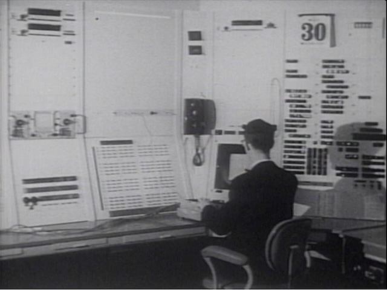

# Sketchpad CRT Display

Sketchpad ran on the TX-2 computer with a 7" x 7" Cathod Ray Tube to display its graphical interface:

It stored 32,000 "spots" in a display table (or more precisely, two display tables for double-buffering), each a 36 bit word:

* 10 bit horizontal and 10 bit vertical deflection of ray, origin at center, "signed fraction of full scope deflection" (pg. 70)
* 16 bit tag (to identify what part of the drawing is sensed by the light pen)

This means it had a "resolution" of 1024x1024 spot positions, which some reports incorrectly call a 1024x1024 pixel display. But this was not a raster display, but displayed individual points. Normally the spots bleed into each other visually, but they can be drawn apart too:

This can be seen especially well in [this video](crt.mp4).

Based on this video here's a few estimates:

* The vertical line between the F and S sides consists of 25 individual points and is about 20% of the screen height long. The two lines at the lower edge of F and S has 39 points, taking up about 29% of the screenwidth.

* In both cases the distance between spots is about 1.2 mm.

* 1024 positions on a 7" wide screen gives a precision of about 0.17 mm.

* that's about 7x the spot distance, making the animation of the spots along the lines plausible

* the spot size appears to be 1/3rd of the distance between spots, making it about 0.4 mm, or 1/400th of the screen width, or 2 display units. This ensures spots "bleed" into each other to form contiuous lines.

* assuming the point density is the same for the whole drawing, there's about 1,500 spots on the screen. Knowing that this uses 1:8 interlaced spot rendering there's a total of 12,000 spots which is in line with the 16,000 max spot number.

# Display

The display system, or "scope" on the TX-2 is able to draw up to 100,000 spots per second, but the actual program used 20 microseconds per spot, so the actual rate was 50,000 spots per second (pg. 67). The display table stored up to 16,000 spots (32,000 words due to double-buffering).

The system displayed dots either consecutively, or "interlaced" showing every 8th spot. This reduced flicker at the expense of a crawling pattern and can be switched on by the user (pg. 68).

Another display mode is "twinkling", using a random order which is "pleasing to the eye" (pg. 68). This, too, could be enabled by the user.

# Pen Tracker

The Light Pen required a tracking pattern to determine which way the pen moved. Figure 4.4 of the thesis shows several patterns. Sutherland writes "I use the logarithmic scan with 4 arms." The middle of the pattern is left empty. This is used to show a "pseudo pen location" as a "bright dot" that jumps away from the pattern when snapping to a point or line (pg. 66).

